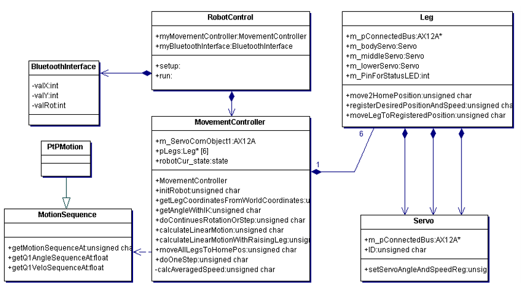

# Hexapod Botolomaeus

## Description

Project in collaboration of five students to successfully design and develop a six-legged robot (Hexapod), controllable through an Android device. 

## Video

## Version

v1.0.0
All basic functions are implemented. Robot can be controlled by an android device. It can move in X, Y direction and rotate around the Z axis.
_____
Hardware that is being used:

-Dynamixel AX-18A (http://emanual.robotis.com/docs/en/dxl/ax/ax-18a/)  
-Arduino 2560

_____
Additionally Files:  
Servo_EEPROM_INIT/Servo_EEPROM_INIT.ino  -->File is used for the very first initialization of the servos e.g. setting ID's.   
_____
Libraries needed:   
https://github.com/ThingType/AX-12A-servo-library
_____
Main Files:  
Rough class structure from 16.06.2018

_____   
Team member:   
Hardware design and manufacturing:   
    Jan Homann, Joel Seelinger, Sameer Al-Qadasi   
Software design and implementation:   
    Tomislav Romic, Philine Stark, Henri Hildebrand    
